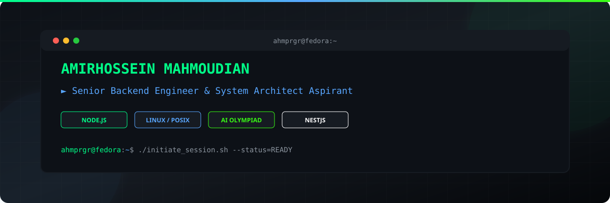
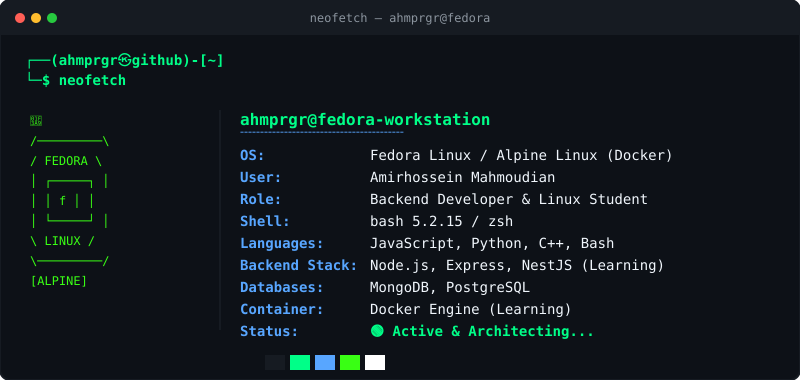

<div align="center">

  <!-- Header Banner -->
  

  <br/><br/>

  <!-- Capsule Header SVG -->
  

  <br/>

  <!-- Typing SVG -->
  <a href="https://git.io/typing-svg">
    
  </a>

  <br/><br/>

  <!-- Quick Badges -->
  <p align="center">
    <a href="https://github.com/ahmprgr">
      
    </a>
    <a href="https://github.com/ahmprgr?tab=followers">
      
    </a>
    <a href="https://github.com/ahmprgr">
      
    </a>
  </p>

</div>

<hr />

## ⚡ Terminal Diagnostic (`neofetch`)

<div align="center">
  
</div>

<br/>

<table width="100%">
  <tr>
    <td width="50%" valign="top">
      <h3>👨‍💻 System Bio</h3>
      <ul>
        <li><b>Identity:</b> Amirhossein Mahmoudian (<code>ahmprgr</code>)</li>
        <li><b>Location:</b> Islamic Republic of Iran 🇮🇷</li>
        <li><b>Core Focus:</b> High-Performance Backend Systems & Low-Level Mechanics</li>
        <li><b>Specialization:</b> Node.js ecosystem, relational/non-relational architecture, Linux system administration</li>
        <li><b>Academic Quest:</b> AI Olympiad Aspirant & Competitive Programmer</li>
      </ul>
    </td>
    <td width="50%" valign="top">
      <h3>🎯 Core Focus & Philosophy</h3>
      <ul>
        <li><b>Philosophy:</b> <i>"If it can be automated or optimized, it must be."</i></li>
        <li><b>Current Deep-Dive:</b> Event Loop internals, NestJS microservices, Docker container runtime mechanics.</li>
        <li><b>Linux Arsenal:</b> Workstation on <b>Fedora</b>, light-weight container setups on <b>Alpine</b>.</li>
        <li><b>Open Source:</b> Active participant in community tooling and system utilities.</li>
      </ul>
    </td>
  </tr>
</table>

<hr />

## 🛠️ Tech Stack & Cyber Arsenal

<div align="center">

  ### Languages & Core Runtimes
  <p align="center">
    <a href="https://skillicons.dev">
      
    </a>
  </p>

  ### Backend Frameworks & Ecosystem
  <p align="center">
    <a href="https://skillicons.dev">
      
    </a>
  </p>

  ### Databases, Storage & Caching
  <p align="center">
    <a href="https://skillicons.dev">
      
    </a>
  </p>

  ### DevOps, Linux & Infrastructure
  <p align="center">
    <a href="https://skillicons.dev">
      
    </a>
  </p>

  ### Tools & Environment
  <p align="center">
    <a href="https://skillicons.dev">
      
    </a>
  </p>

</div>

<hr />

## 🗺️ Engineering Journeys & Milestones

<table width="100%">
  <tr>
    <th width="33%">⚙️ Backend Mastery</th>
    <th width="33%">🐧 Linux & Systems</th>
    <th width="34%">🧠 AI Olympiad</th>
  </tr>
  <tr>
    <td valign="top">
      <ul>
        <li>✅ REST API Design & CRUD Architectures</li>
        <li>✅ Express.js Middleware Patterns</li>
        <li>✅ MongoDB Aggregations & Schema Design</li>
        <li>✅ PostgreSQL Relations & Transactions</li>
        <li>🔄 <b>NestJS Architecture & DI</b></li>
        <li>🔄 Microservices & Message Queues</li>
        <li>⏳ System Design & Scalability</li>
      </ul>
    </td>
    <td valign="top">
      <ul>
        <li>✅ POSIX Shell Scripting & Automation</li>
        <li>✅ Storage Management & Permissions</li>
        <li>✅ Package Management (DNF / APK)</li>
        <li>✅ Process Isolation & Systemctl</li>
        <li>🔄 <b>Docker Engine Mechanics</b></li>
        <li>🔄 Custom Linux Kernel Compilation</li>
        <li>⏳ Network Protocol Deep-Dives</li>
      </ul>
    </td>
    <td valign="top">
      <ul>
        <li>✅ Discrete Mathematics Fundamentals</li>
        <li>✅ Classical Graph Algorithms & Search</li>
        <li>✅ Dynamic Programming Patterns</li>
        <li>✅ Python ML Stack (NumPy, Pandas)</li>
        <li>🔄 <b>Neural Networks & Backpropagation</b></li>
        <li>🔄 Advanced Heuristic Algorithms</li>
        <li>⏳ Competitive Algorithmic Mastery</li>
      </ul>
    </td>
  </tr>
</table>

<hr />

## 📊 Live Progress Tracker

```text
Backend Engineering [==========================>   ] 85%
Linux Kernel & Sys  [=========================>    ] 80%
AI & Algorithms     [======================>       ] 70%
NestJS Ecosystem    [=================>            ] 55%
Docker & DevOps     [===============>              ] 50%
